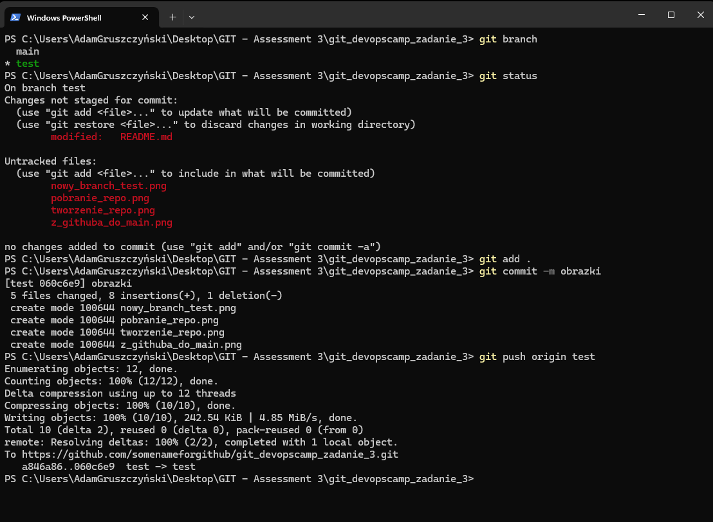

# git_devopscamp_zadanie_3
Reopzytorium do zadania 3 - utworzenie nowego repo na githubie

## pierwsza zmiana
Z poziomu github do jedynego brancha - main

## nowy branch
z poziomu githuba commit do nowego brancha - test

## pobranie repo
Pobrałem repozytorium do lokalnego gita. Dodatkowo utworzyłem lokalny branch test i pobrałem do niego branch test z githuba.

## dodanie obraków + push test
w lokalnym git dodaję obrazki w branch test
Wysyłam lokalny branch test do zdalnego test
